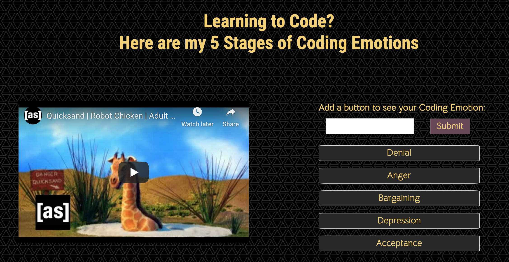

# gifTastic

### Overview:

GIPHY API to make a dynamic web page that populates with gifs of your choice. 
To finish this task, you must call the GIPHY API and use JavaScript and jQuery to change the HTML of your site.
Other resources: CSS, Bootstrap, GoogleFonts

### Link to game: https://lindseytummond.github.io/gifTastic/

### Instructions:

1. Create an array of strings, each one related to a topic that interests you. 

2. Your app should take the topics in this array and create buttons in your HTML.

3. When the user clicks on a button, the page should grab 10 static, non-animated gif images from the GIPHY API and place them on the page.

4. When the user clicks one of the still GIPHY images, the gif should animate. If the user clicks the gif again, it should stop playing.

5. Under every gif, display its rating (PG, G, so on).
  
6. Add a form to your page that takes a value from a user input box and adds it to your array. Then make a function call that takes each topic in the array and remakes the buttons on the page.

